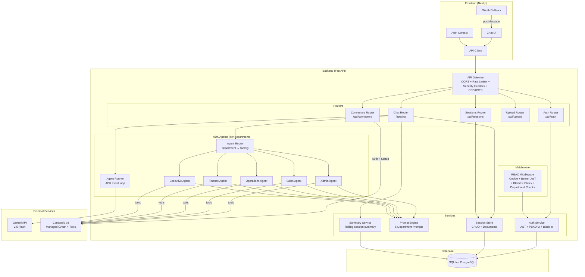
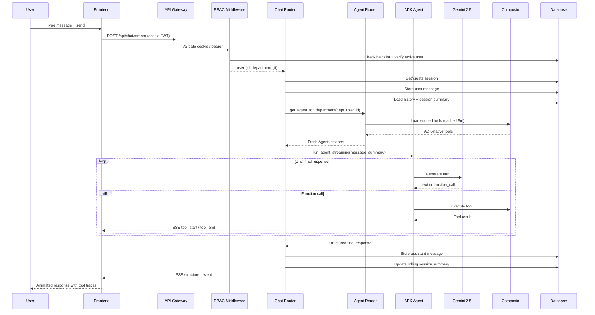
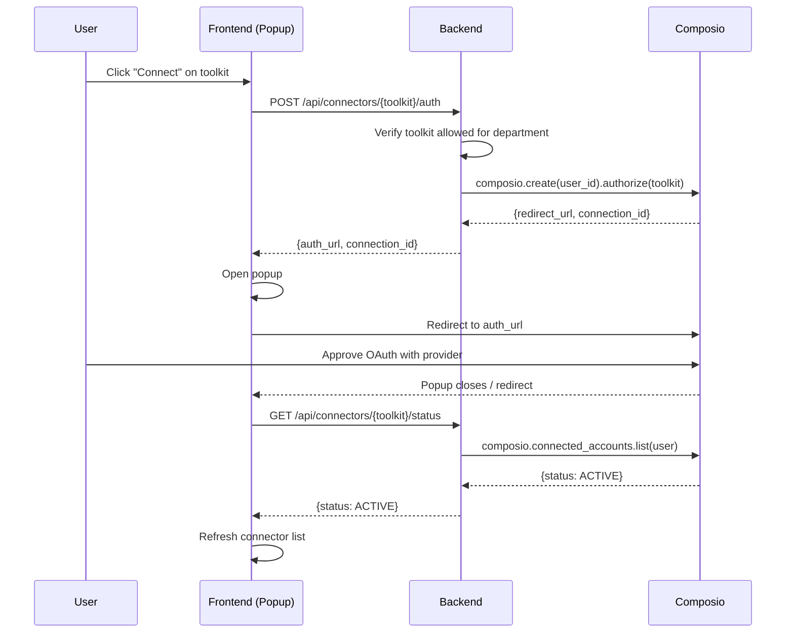
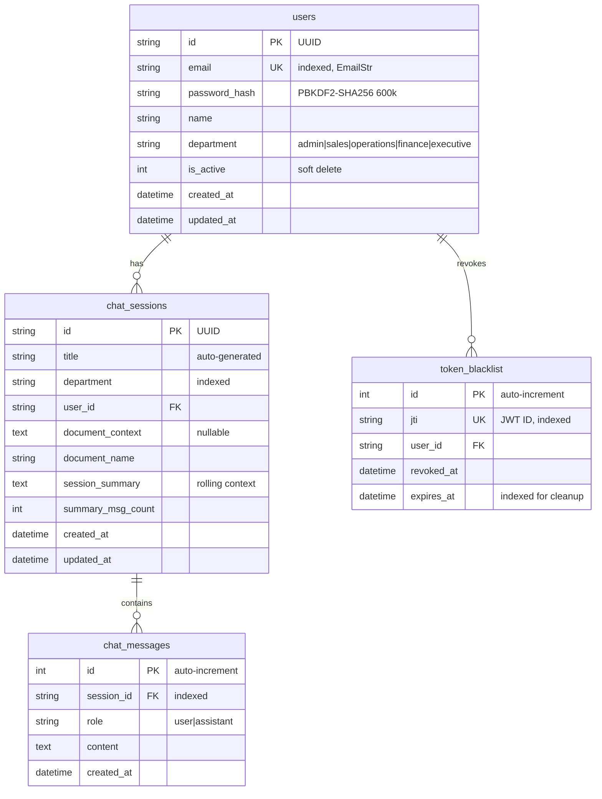
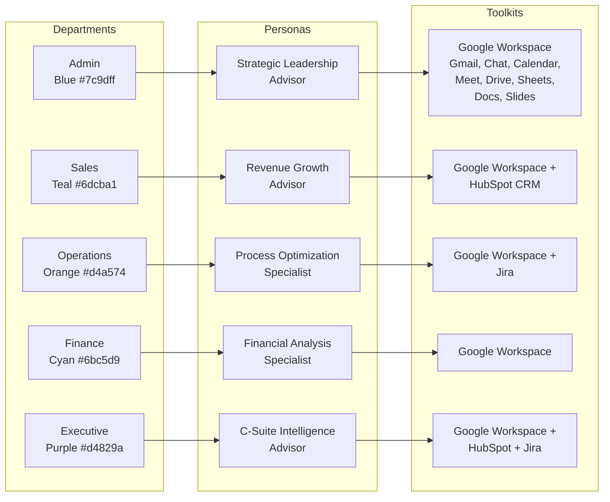
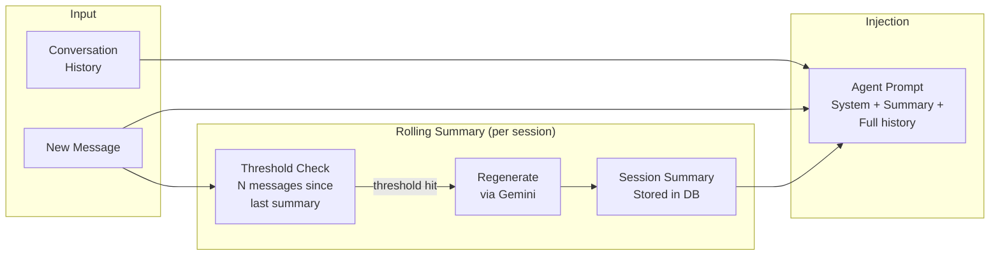
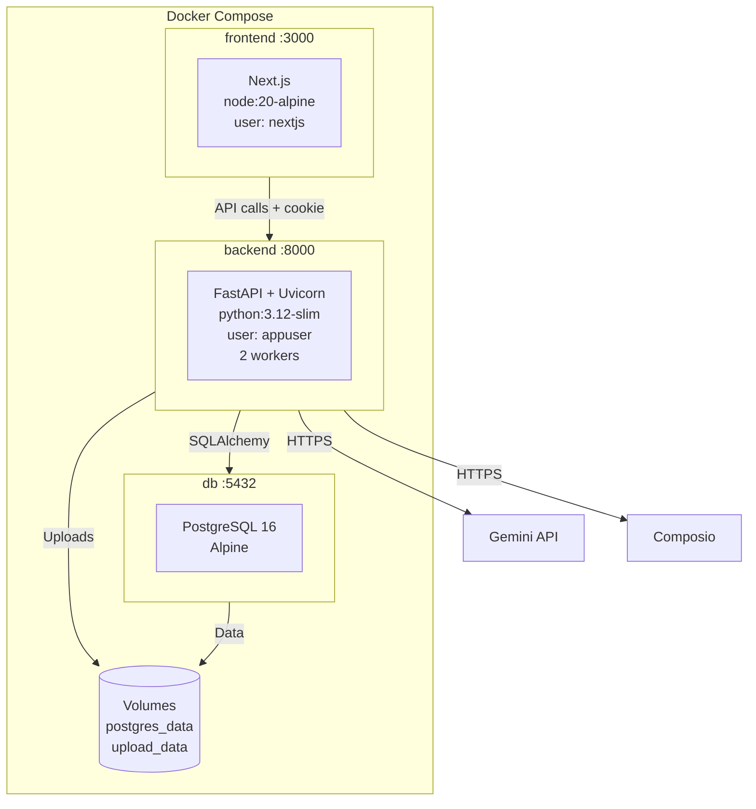
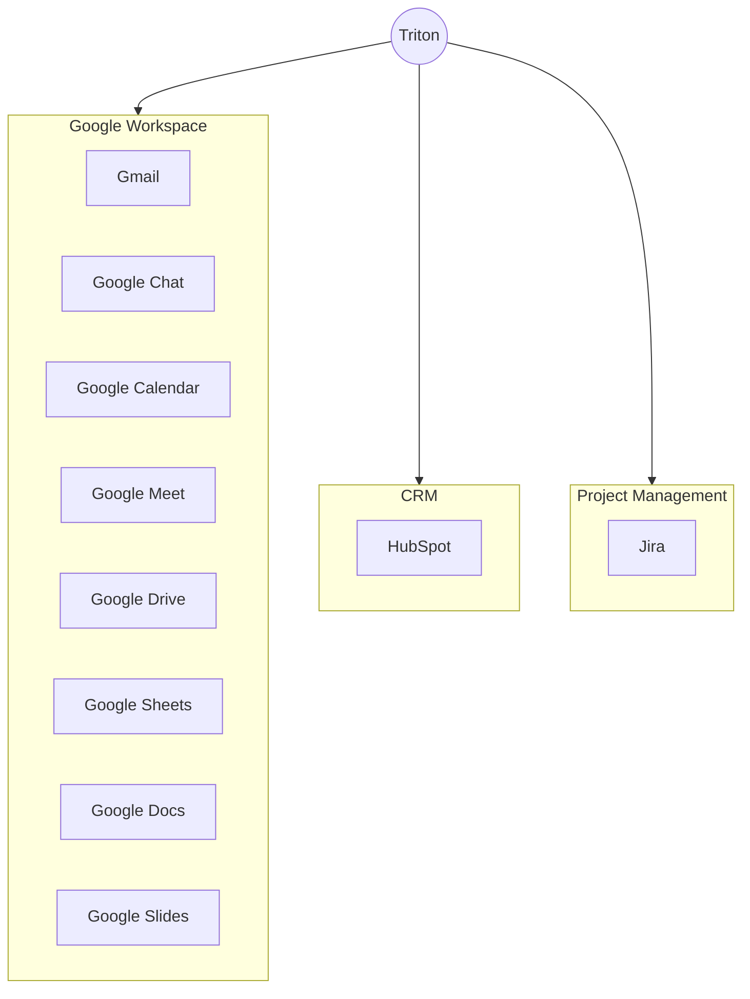

# Kizuna

A production-grade, five-department AI chat platform combining **Gemini 2.5 Flash**, **Google ADK agents**, **Composio v3 tool integrations**, and **department-based access control**. Each department gets a dedicated ADK agent with role-specific prompts and a scoped set of Composio-managed SaaS tools.

---

## Architecture Overview



---

## Request Flow



---

## Connector Flow (Composio v3)



Composio manages all OAuth provider registrations, token storage, and refresh — the backend only ever sees `user_id`, toolkit slug, and connection status.

---

## Database Schema



Composio handles all connected-account state — there is no local `user_connectors` table; connection status is fetched live via `composio.connected_accounts.list()`.

---

## Department System



Each department has **5 prompt templates** (25 total) for common tasks like forecasting, report generation, compliance checklists, etc. Agent factories in `backend/agents/` build a fresh ADK `Agent` per request, scoped to the user's department toolkits.

---

## Session Context System



Instead of a vector memory store, Triton uses a **rolling session summary** regenerated periodically by Gemini and stored alongside the session in the database. This keeps long conversations coherent without the cost and latency of embedding + vector search on every turn.

---

## Tech Stack

| Layer | Technology |
|-------|-----------|
| **Frontend** | Next.js, React 19, TypeScript, Tailwind CSS |
| **Backend** | FastAPI, Uvicorn, SQLAlchemy |
| **LLM** | Gemini 2.0 Flash (OpenRouter) |
| **Agents** | OpenAI SDK (OpenRouter-compatible) |
| **Connectors** | Composio v3 SDK |
| **Database** | SQLite (dev) / PostgreSQL (prod) |
| **Auth** | JWT in httpOnly cookie + PBKDF2-SHA256 (600k) + token blacklist |
| **Rate Limiting** | slowapi (login 10/min, register 5/hr, chat 30/min) |
| **Containerization** | Docker + Docker Compose |

---

## Getting Started

### Prerequisites

- Python 3.12+
- Node.js 20+
- [Gemini API Key](https://aistudio.google.com) (required)
- [Composio API Key](https://composio.dev) (required for tools)
- (Optional) Docker & Docker Compose

### 1. Clone the Repository

```bash
git clone https://github.com/TetraNoodle-Technologies/Triton---AI-matchone-medical.git
cd Triton---AI-matchone-medical
```

### 2. Backend Setup

```bash
cd backend
python3 -m venv venv
source venv/bin/activate
pip install -r requirements.txt
```

### 3. Configure Environment

```bash
cp .env.example backend/.env
```

Edit `backend/.env` and set the required values:

```env
# Required
OPENROUTER_API_KEY=your_openrouter_api_key
COMPOSIO_API_KEY=your_composio_api_key
JWT_SECRET=$(openssl rand -hex 32)

# Optional overrides
LLM_MODEL=google/gemini-3.5-flash
CORS_ORIGINS=http://localhost:3000,http://127.0.0.1:3000
RATE_LIMIT_PER_MINUTE=30
```

### 4. Frontend Setup

```bash
cd frontend
npm install
```

### 5. Run the Application

**Development (two terminals):**

```bash
# Terminal 1 — Backend
cd backend
source venv/bin/activate
uvicorn main:app --reload --port 8000

# Terminal 2 — Frontend
cd frontend
npm run dev
```

**Docker Compose (production-style):**

```bash
export POSTGRES_PASSWORD=your_db_password
export OPENROUTER_API_KEY=your_openrouter_key
export COMPOSIO_API_KEY=your_composio_key
export JWT_SECRET=$(openssl rand -hex 32)

docker compose up --build
```

### 6. Access the Application

| Service | URL |
|---------|-----|
| Frontend | http://localhost:3000 |
| Backend API | http://localhost:8000 |
| API Docs (Swagger) | http://localhost:8000/api/docs *(dev only)* |
| API Docs (ReDoc) | http://localhost:8000/api/redoc *(dev only)* |
| Health Check | http://localhost:8000/api/health |

API docs are disabled when `ENVIRONMENT=production`.

---

## Deployment Diagram



---

## API Endpoints

### Authentication

| Method | Endpoint | Description | Auth | Rate Limit |
|--------|----------|-------------|------|------------|
| POST | `/api/auth/register` | Register new user | None | 5/hour |
| POST | `/api/auth/login` | Login, sets httpOnly cookie + returns JWT | None | 10/minute |
| POST | `/api/auth/logout` | Revoke current token (blacklist jti) | Cookie/Bearer | — |
| GET | `/api/auth/me` | Get current user | Cookie/Bearer | — |
| GET | `/api/auth/users` | List users (admin only) | Cookie/Bearer | — |
| DELETE | `/api/auth/users/{id}` | Deactivate user (admin) | Cookie/Bearer | — |

### Chat

| Method | Endpoint | Description | Auth | Rate Limit |
|--------|----------|-------------|------|------------|
| POST | `/api/chat` | Send message, get structured response | Cookie/Bearer | 30/minute |
| POST | `/api/chat/stream` | Send message, SSE stream with tool traces | Cookie/Bearer | 30/minute |

### Sessions

| Method | Endpoint | Description | Auth |
|--------|----------|-------------|------|
| POST | `/api/sessions` | Create new session | Cookie/Bearer |
| GET | `/api/sessions` | List user's sessions | Cookie/Bearer |
| GET | `/api/sessions/{id}` | Get session with messages | Cookie/Bearer |
| DELETE | `/api/sessions/{id}` | Delete session | Cookie/Bearer |
| GET | `/api/sessions/templates/prompts` | Get department templates | Cookie/Bearer |

### Connectors (Composio-backed)

| Method | Endpoint | Description | Auth |
|--------|----------|-------------|------|
| GET | `/api/connectors` | List toolkits for user's department with status | Cookie/Bearer |
| POST | `/api/connectors/{toolkit}/auth` | Start Composio OAuth, returns redirect URL | Cookie/Bearer |
| GET | `/api/connectors/{toolkit}/status` | Check connection status | Cookie/Bearer |
| POST | `/api/connectors/{toolkit}/disconnect` | Remove connection | Cookie/Bearer |

### Upload

| Method | Endpoint | Description | Auth |
|--------|----------|-------------|------|
| POST | `/api/upload` | Upload document (max 10MB) | Cookie/Bearer |

Supported formats: `.pdf`, `.docx`, `.csv`, `.xlsx`, `.txt`, `.md`

### Health

| Method | Endpoint | Description | Auth |
|--------|----------|-------------|------|
| GET | `/api/health` | Basic health check | None |
| GET | `/api/health/deep` | DB connectivity | None |

---

## Structured Response Format

All chat responses follow a consistent JSON schema:

```json
{
  "title": "Quarterly Revenue Summary",
  "summary": "Revenue grew 12% QoQ driven by enterprise expansion.",
  "sections": [
    {
      "heading": "Revenue Breakdown",
      "content": "**Enterprise**: $2.4M (+18%)\n\n**SMB**: $1.1M (+5%)\n\n| Metric | Q3 | Q4 |\n|--------|-----|-----|\n| MRR | $290K | $325K |"
    },
    {
      "heading": "Key Drivers",
      "content": "- Enterprise deal pipeline increased by 23%\n- Churn rate decreased to 1.8%"
    }
  ],
  "key_takeaways": [
    "Enterprise segment is the primary growth driver",
    "Churn reduction contributed $140K in retained revenue",
    "Pipeline suggests continued acceleration in Q1"
  ],
  "tool_calls": [
    { "name": "Gmail: Send Email", "raw_name": "GMAIL_SEND_EMAIL", "status": "success" }
  ]
}
```

The streaming endpoint additionally emits `tool_start` / `tool_end` SSE events as the agent invokes each tool, so the UI can render live tool traces.

---

## Available Connectors



All connectors are managed by [Composio](https://composio.dev) — OAuth registration, token storage, and refresh are handled by Composio's managed auth; the backend only sees connection status via `composio.connected_accounts.list()`.

---

## Security

| Feature | Implementation |
|---------|---------------|
| Password Hashing | PBKDF2-SHA256, 600k iterations, 32-byte random salt |
| Authentication | JWT in httpOnly cookie (7-day expiry) + optional `Authorization: Bearer` for API clients |
| Token Revocation | `token_blacklist` table; logout inserts `jti`, every request checks |
| Email / Input Validation | Pydantic `EmailStr`, length-bounded fields, stripped names |
| CORS | Restricted origins, `PUT`/`OPTIONS` dropped, wildcard rejected in production |
| Rate Limiting | 30/min chat, 10/min login, 5/hour register |
| Security Headers | CSP, HSTS *(prod)*, X-Frame-Options, Referrer-Policy, Permissions-Policy |
| Cache Control | `no-store` on authenticated `/api/*` responses |
| File Upload | Extension + MIME validation, sanitized filenames, path traversal protection |
| XSS Prevention | rehype-sanitize for markdown, HTML-escaped OAuth callbacks |
| Docker | Non-root containers (appuser / nextjs) |
| Input Length | Max 10k chars per message, 50k chars per document |
| DB Migrations | Allow-listed column adds to prevent SQL injection via `ALTER TABLE` |
| Environment Guards | Production mode blocks SQLite, wildcard CORS, and hides API docs |
| Error Handling | Incident IDs in logs; clients receive only `"Internal server error"` |

---

## Project Structure

```
polaris/
├── backend/
│   ├── main.py                    # FastAPI app, CORS, rate limiter, security headers, CSP
│   ├── config.py                  # Settings, env validation, prod guards
│   ├── models.py                  # Pydantic request/response models
│   ├── Dockerfile                 # Python 3.12-slim, non-root user
│   ├── requirements.txt
│   ├── agents/
│   │   ├── config.py              # ADK + Gemini + Composio key setup
│   │   ├── prompts.py             # Department-specific agent instructions
│   │   ├── router.py              # Department → agent factory dispatch
│   │   ├── runner.py              # ADK event loop + streaming wrapper
│   │   ├── tools.py               # Per-user Composio tool loader (cached)
│   │   ├── admin_agent.py
│   │   ├── sales_agent.py
│   │   ├── ops_agent.py
│   │   ├── finance_agent.py
│   │   └── executive_agent.py
│   ├── db/
│   │   ├── database.py            # SQLAlchemy engine, safe migrations
│   │   └── models.py              # User, ChatSession, ChatMessage, TokenBlacklist
│   ├── middleware/
│   │   └── rbac.py                # Cookie/Bearer JWT validation + blacklist check
│   ├── routers/
│   │   ├── auth.py                # Login, register, logout, user management
│   │   ├── chat.py                # Message handling, SSE streaming, document injection
│   │   ├── sessions.py            # Session CRUD, prompt templates
│   │   ├── upload.py              # File upload with text extraction
│   │   └── connectors.py          # Composio toolkit auth / status / disconnect
│   ├── services/
│   │   ├── auth_service.py        # Password hashing, JWT, blacklist, user CRUD
│   │   ├── prompt_engine.py       # Department-specific system prompts & templates
│   │   ├── summary_service.py     # Rolling session summary (Gemini-generated)
│   │   └── session_store.py       # Session & message persistence
│   └── tests/
│       ├── test_agents_config.py
│       ├── test_agents_router.py
│       ├── test_agents_runner.py
│       ├── test_agents_tools.py
│       └── test_summary_service.py
├── frontend/
│   ├── src/
│   │   ├── app/
│   │   │   ├── page.tsx           # Login page
│   │   │   ├── register/page.tsx  # Registration page
│   │   │   └── chat/page.tsx      # Main chat interface
│   │   └── lib/
│   │       ├── api.ts             # Backend API client
│   │       ├── auth-context.tsx   # Auth state management
│   │       └── themes.ts          # Department color themes
│   ├── next.config.ts             # Security headers, CSP
│   ├── Dockerfile                 # node:20-alpine, non-root user
│   └── package.json
├── docker-compose.yml             # Postgres + Backend + Frontend
├── .env.example                   # Template for environment variables
└── .gitignore
```

---

## Environment Variables Reference

| Variable | Required | Default | Description |
|----------|----------|---------|-------------|
| `OPENROUTER_API_KEY` | Yes | — | OpenRouter API key (https://openrouter.ai) |
| `COMPOSIO_API_KEY` | Yes* | — | Composio API key (*required for tool use*) |
| `JWT_SECRET` | Yes | — | Secret for signing JWTs (min 32 chars) |
| `ENVIRONMENT` | No | `development` | `development` or `production` — flips prod guards |
| `LLM_MODEL` | No | `google/gemini-3.5-flash` | OpenRouter model ID |
| `DATABASE_URL` | No | `sqlite:///./data/triton.db` | DB connection string (SQLite blocked in prod) |
| `CORS_ORIGINS` | No | `http://localhost:3000,http://127.0.0.1:3000` | Comma-separated allowed origins |
| `FRONTEND_URL` | No | `http://localhost:3000` | Frontend URL for OAuth callbacks |
| `RATE_LIMIT_PER_MINUTE` | No | `30` | Global rate limit |
| `JWT_EXPIRE_HOURS` | No | `168` | Token expiry (default 7 days) |
| `COOKIE_SECURE` | No | `false` | `true` in production (HTTPS only) |
| `COOKIE_SAMESITE` | No | `lax` | `lax` same-site, `none` cross-site (requires Secure) |
| `COOKIE_DOMAIN` | No | *empty* | e.g. `.yourdomain.com` for cross-subdomain cookies |
| `UPLOAD_DIR` | No | `./data/uploads` | File upload directory |
| `POSTGRES_PASSWORD` | Docker | — | PostgreSQL password (Docker Compose only) |

---

## License

Proprietary. All rights reserved.
